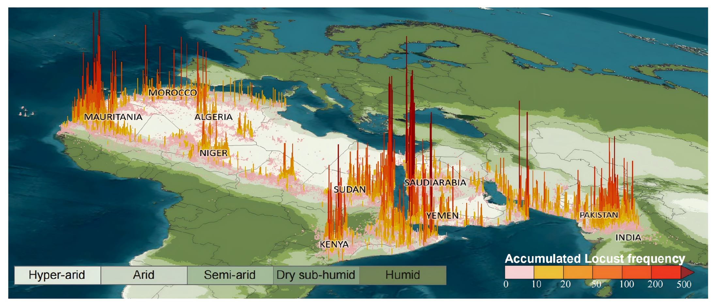

<h1 align="center">Multimodal Large Language Models for Global Desert Locust Risk Prediction</h1>

The proposed**LocaR** is a multimodal large language model designed for global desert locust (Schistocerca gregaria) presence risk prediction. Built upon Qwen3-VL-4B, it is fine-tuned through a two-stage training pipeline combining lightweight supervised fine-tuning and reinforcement learning on a curated 43-year locust event dataset.




## Intended use 
- Early warning systems for locust outbreak risk assessment
- Decision support for desert locust surveillance and monitoring
- Multimodal reasoning research on spatiotemporal environmental data 


## Acknowledge

This repository is built on top of the [VERL framework](https://github.com/verl-project/verl). We would like to express our sincere gratitude to the VERL team for their outstanding work.

## Dataset

The used  dataset can be download [here](https://drive.google.com/file/d/1O_8F2ZDJQEMB9tEdAvUsFfg6nvnzq4Zi/view?usp=sharing) 

Please unzip the RAR file into your specific folder. 

## Installation

### 1. Set Up UV Environment

```
pip install uv
uv venv --python 3.12 --seed 
source .venv/bin/activate
```


### 2. Install dependencies

```bash
uv pip install "sglang[all]==0.5.2" --no-cache-dir && pip install torch-memory-saver --no-cache-dir
uv pip install --no-cache-dir "vllm==0.11.0"
uv pip install pytest 
uv pip install "transformers[hf_xet]>=4.51.0" accelerate datasets peft hf-transfer \
    "numpy<2.0.0" "pyarrow>=15.0.0" pandas "tensordict>=0.8.0,<=0.10.0,!=0.9.0" torchdata \
    ray[default] codetiming hydra-core pylatexenc qwen-vl-utils wandb dill pybind11 liger-kernel mathruler \
    pytest py-spy pre-commit ruff tensorboard 
uv pip install "nvidia-ml-py>=12.560.30" "fastapi[standard]>=0.115.0" "optree>=0.13.0" "pydantic>=2.9" "grpcio>=1.62.1"
uv pip install --no-cache-dir flashinfer-python==0.3.1

uv pip install opencv-python
uv pip install opencv-fixer && \
    python -c "from opencv_fixer import AutoFix; AutoFix()"

```


### 3. install verl from source

```
git clone https://ghfast.top/https://github.com/volcengine/verl.git
cd verl
uv pip install --no-deps -e .
```


## Quickly Start (evaluation or RL training)

**Note:** Please update `data.train_files` and `data.val_files` in the following shell scripts so that they point to the actual paths of your local training and validation dataset files.

### Evaluation script

```bash
bash LocaR-SFT-RL-4B_test.sh
```

### RL training script

```bash
bash LocaR_RL_traininig.sh 
```


